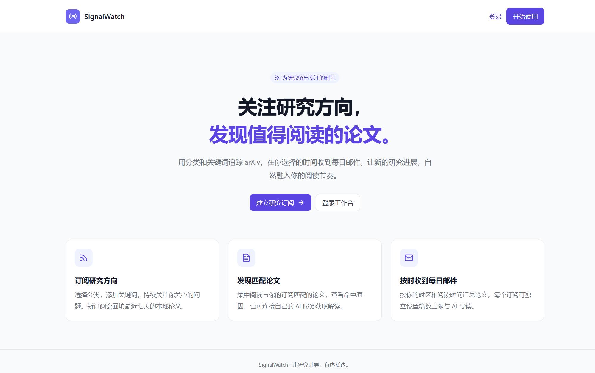
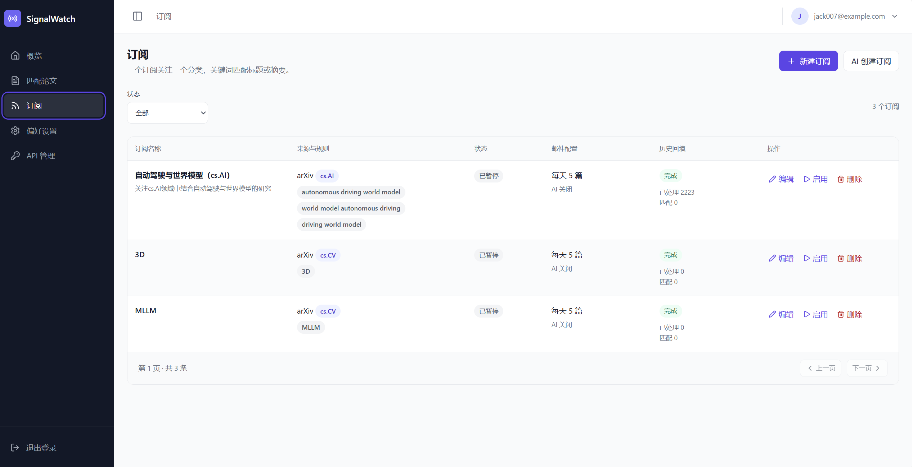
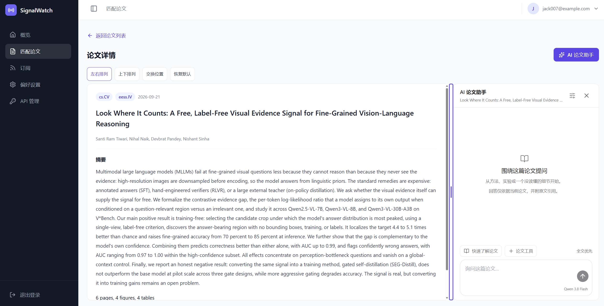
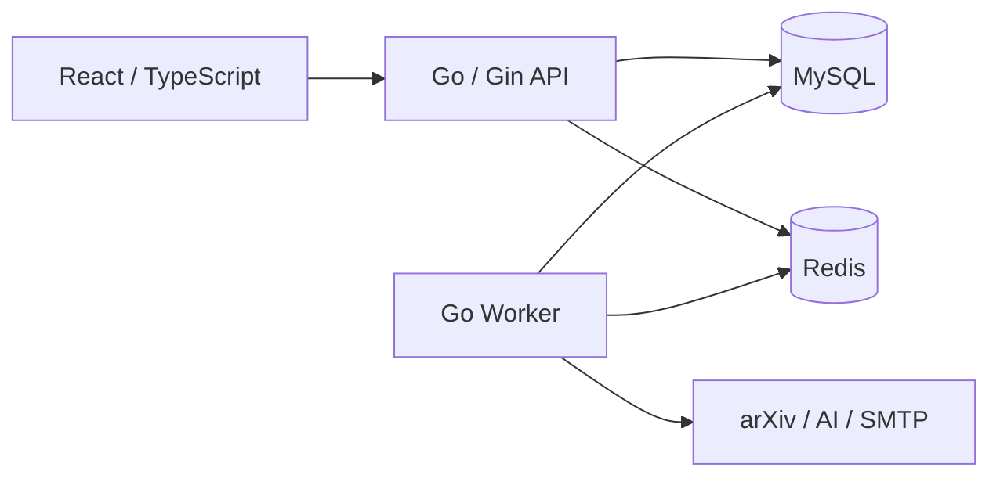

# SignalWatch

[简体中文](README.md) | **English**

SignalWatch helps you discover, subscribe to, and read arXiv papers, with daily email digests and AI reading assistance powered by your own model API key.

## Features

### Discover papers worth reading

Follow research topics by arXiv category and keywords, and receive daily paper digests at your preferred time and time zone.



### Manage research subscriptions

Create, edit, or pause subscriptions, set a daily paper limit for each, or let AI draft a subscription based on your research interests. New subscriptions backfill locally stored papers from the past seven days.



### Read papers with AI assistance

View paper details alongside the AI assistant, ask questions or generate a reading report, and check answers against citations from the paper.



## Architecture

The frontend uses React / TypeScript / Vite. The backend consists of a Go / Gin API and a separate Worker. MySQL stores application data and tasks, while Redis supports rate limiting and operational status. The Worker handles paper collection, subscription matching, AI processing, and email delivery.



Vite serves the frontend and proxies API requests locally. In production, Nginx serves static files, terminates HTTPS, and proxies API requests.

## Local setup

Requires **Go 1.26.5, Node.js 22.x, npm, Make, and Docker Compose v2**. With nvm, run `nvm install && nvm use`. Run all commands from the project root.

### 1. Configure the environment

```bash
test -f .env || cp .env.example .env
chmod 600 .env
```

Edit `.env`. See [.env.example](.env.example) for all available options:

| Setting | Description |
| --- | --- |
| `MYSQL_DATABASE`, `MYSQL_USER`, `MYSQL_PASSWORD`, `MYSQL_ROOT_PASSWORD` | Database and account settings; replace the example passwords |
| `MYSQL_DSN` | The username, password, and database name must match the settings above |
| `REDIS_PASSWORD` | Replace the example Redis password |
| `JWT_SECRET` | A random secret of at least 32 characters; generate one with `openssl rand -hex 32` |
| `APP_PUBLIC_URL` | Use `http://127.0.0.1:5173` locally for links to the app in emails |
| `SMTP_*` | Defaults to local Mailpit; configure an SMTP service for real email delivery |
| `AI_ENABLED` | Defaults to `false`; standard subscriptions and email do not require a model service |

### 2. Initialize dependencies

Install the database migration tool (skip installation if Goose v3.24.3 is already available), then start MySQL, Redis, and Mailpit and run migrations:

```bash
mkdir -p .tools/bin
GOBIN="$PWD/.tools/bin" go install -tags=no_sqlite3 github.com/pressly/goose/v3/cmd/goose@v3.24.3
export PATH="$PWD/.tools/bin:$PATH"

make deps-up
make migrate-up
npm --prefix web ci
```

### 3. Start the application

Open three terminals, enter the project root in each, and run the corresponding command:

```bash
# Terminal 1: HTTP API
make api

# Terminal 2: background tasks
make worker

# Terminal 3: frontend development server
make web-dev
```

| Entry point | URL |
| --- | --- |
| Web app | <http://127.0.0.1:5173> |
| Local email inbox | <http://127.0.0.1:8025> |
| API readiness check | <http://127.0.0.1:8080/readyz> |

Open the app, register an account, create a subscription, and set your time zone and email schedule in Preferences (偏好设置). Initial collection takes time; keep the Worker running.

`make api` and `make worker` load the root `.env` file. Stop each process with `Ctrl+C`; `make deps-down` stops dependency containers while preserving their data volumes.

## Optional: enable AI

Generate a server encryption master key:

```bash
openssl rand -base64 32
```

Add the result to `.env`. The API and Worker must use the same configuration:

```dotenv
AI_ENABLED=true
AI_CREDENTIAL_KEYS=v1:<generated Base64 key>
AI_CREDENTIAL_ACTIVE_KEY_VERSION=v1
```

The master key encrypts users' model API keys. Back it up and keep it stable. Restart the API and Worker after changing the configuration. In API Management (API 管理), add a provider, model, and personal API key, validate it, and save it. Choose a default entry for summaries and emails.

AI enables subscription creation, paper Q&A and reading reports, and daily AI email introductions in subscription settings. Full-text extraction requires `pdftotext`, `pdfinfo`, `pdfimages`, and `prlimit` on the Worker host. On Debian / Ubuntu, install `poppler-utils` and `util-linux`; the production image already includes them. When full text is unavailable, the assistant clearly labels its use of abstract-only material.

## Production deployment with Docker Compose

<details>
<summary>Show deployment steps</summary>

See [deploy/compose.prod.yaml](deploy/compose.prod.yaml) for the production stack. These steps require a Linux host with Docker Compose v2, Node.js 22.x, npm, Make, and Python 3; the backend builds inside a container. Nginx exposes ports 80 / 443 and redirects HTTP to HTTPS.

### 1. Prepare configuration and certificates

```bash
test -f deploy/.env.production || cp deploy/.env.example deploy/.env.production
chmod 600 deploy/.env.production
mkdir -p .deploy/web .deploy/certs
```

Edit `deploy/.env.production` using [deploy/.env.example](deploy/.env.example) as the template:

- Set the actual `SERVER_NAME` and HTTPS `APP_PUBLIC_URL`, and point the domain to the deployment host.
- Set `WEB_ROOT` and `TLS_CERT_DIR` to the **absolute paths** of the project's `.deploy/web` and `.deploy/certs` directories. The certificate directory must contain `fullchain.pem` and `privkey.pem` for the domain.
- Configure MySQL, Redis, JWT, and a real SMTP service. Use `mysql:3306` in `MYSQL_DSN`, with credentials matching `MYSQL_*`. To enable AI, add the AI settings above to this file.
- Set `BACKEND_VERSION` as the backend image tag. The API and Worker share this image.
- Set `MYSQL_VOLUME_NAME` and `REDIS_VOLUME_NAME` to the actual data volume names. For a fresh deployment using the template's names, run the commands below first. For an existing deployment, use the original volume names to retain its data.

```bash
docker volume create signalwatch_mysql_data
docker volume create signalwatch_redis_data
```

### 2. Start the backend and publish the frontend

Run from the project root. Before upgrading an existing deployment, back up the database and stop the old Worker. After migration, start the API and Worker on the same version.

```bash
dc() {
  docker compose --env-file deploy/.env.production -f deploy/compose.prod.yaml "$@"
}

dc config --quiet
dc build api
dc up -d --wait mysql redis
dc run --rm migrate up
dc up -d api worker nginx

make web-build
make web-publish RELEASE=v1 \
  WEB_ROOT="$PWD/.deploy/web" \
  WEB_CHECK_URL=https://signalwatch.example.com
```

Replace `WEB_CHECK_URL` with the actual site URL and keep `WEB_ROOT` consistent with the production configuration. The site returns 404 before the first frontend release. Release checks must be able to reach Nginx from the deployment host through that HTTPS URL. For a private CA, append `WEB_CA_FILE=/absolute/path/ca.pem`. Use a new `RELEASE` value for each subsequent release.

After deployment, open the site, run `dc ps` to check service status, and use `dc logs --tail=100 api worker nginx` to inspect logs.

</details>
