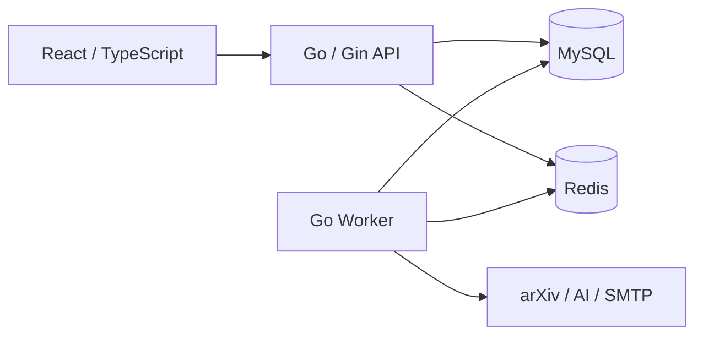

# SignalWatch

**简体中文** | [English](README.en.md)

SignalWatch 是一个面向 arXiv 的论文订阅与阅读工具，支持按研究方向发现论文、每日邮件推送，以及接入个人模型 API Key 的 AI 辅助阅读。

## 功能预览

### 发现值得阅读的论文

按 arXiv 分类和关键词追踪研究方向，在你设定的时区和时间接收每日论文邮件。


### 管理研究订阅

创建、编辑或暂停订阅，为每个订阅设置每日篇数，也可以让 AI 根据研究兴趣生成订阅草案。新订阅会回填最近七天的本地论文。


### 阅读论文与 AI 问答

查看论文详情，与 AI 助手并排阅读、围绕论文提问或生成阅读报告，并通过原文引用核对回答。


## 简要架构

前端使用 React / TypeScript / Vite，后端由 Go / Gin API 和独立 Worker 组成。MySQL 保存业务数据与任务，Redis 用于限速与运行状态；Worker 负责论文采集、订阅匹配、AI 处理和邮件发送。



本地由 Vite 提供页面并代理 API 请求；生产环境由 Nginx 提供静态页面、HTTPS 和 API 反向代理。

## 本地启动

需要 **Go 1.26.5、Node.js 22.x、npm、Make、Docker Compose v2**。使用 nvm 时可执行 `nvm install && nvm use`。以下命令均在项目根目录执行。

### 1. 配置环境

```bash
test -f .env || cp .env.example .env
chmod 600 .env
```

编辑 `.env`，完整选项见 [.env.example](.env.example)：

| 配置 | 说明 |
| --- | --- |
| `MYSQL_DATABASE`、`MYSQL_USER`、`MYSQL_PASSWORD`、`MYSQL_ROOT_PASSWORD` | 数据库与账号配置；替换示例密码 |
| `MYSQL_DSN` | 连接串中的账号、密码、库名须与上述配置一致 |
| `REDIS_PASSWORD` | 替换示例 Redis 密码 |
| `JWT_SECRET` | 至少 32 字符的随机密钥，可用 `openssl rand -hex 32` 生成 |
| `APP_PUBLIC_URL` | 本地设为 `http://127.0.0.1:5173`，用于邮件中的站内链接 |
| `SMTP_*` | 默认投递到本地 Mailpit；真实邮件需填写 SMTP 服务配置 |
| `AI_ENABLED` | 默认 `false`；普通订阅和邮件无需模型服务 |

### 2. 初始化依赖

安装数据库迁移工具（已有 Goose v3.24.3 时可跳过安装），然后启动 MySQL、Redis、Mailpit 并执行迁移：

```bash
mkdir -p .tools/bin
GOBIN="$PWD/.tools/bin" go install -tags=no_sqlite3 github.com/pressly/goose/v3/cmd/goose@v3.24.3
export PATH="$PWD/.tools/bin:$PATH"

make deps-up
make migrate-up
npm --prefix web ci
```

### 3. 启动应用

在三个终端中分别进入项目根目录并运行：

```bash
# 终端一：HTTP API
make api

# 终端二：后台任务
make worker

# 终端三：前端开发服务器
make web-dev
```

| 入口 | 地址 |
| --- | --- |
| 网页 | <http://127.0.0.1:5173> |
| 本地邮件收件箱 | <http://127.0.0.1:8025> |
| API 就绪检查 | <http://127.0.0.1:8080/readyz> |

打开网页注册账号，创建订阅，并在「偏好设置」中设置时区和邮件时间。首次采集需要时间，Worker 需持续运行。

`make api` 和 `make worker` 会加载根目录 `.env`。使用 `Ctrl+C` 停止各进程，`make deps-down` 停止依赖容器并保留数据卷。

## 可选：启用 AI

生成服务端加密主密钥：

```bash
openssl rand -base64 32
```

将输出填入 `.env`，API 和 Worker 必须使用相同配置：

```dotenv
AI_ENABLED=true
AI_CREDENTIAL_KEYS=v1:<生成的 Base64 密钥>
AI_CREDENTIAL_ACTIVE_KEY_VERSION=v1
```

主密钥用于加密用户的模型 API Key，请备份并保持稳定。修改后重启 API 和 Worker，在网页「API 管理」中添加供应商、模型和个人 API Key，验证后保存；设置默认条目供摘要和邮件使用。

启用后可使用 AI 创建订阅、论文问答与阅读报告，以及订阅中的每日邮件 AI 导读。全文解析需要 Worker 主机提供 `pdftotext`、`pdfinfo`、`pdfimages` 和 `prlimit`；Debian / Ubuntu 可安装 `poppler-utils`、`util-linux`，生产镜像已包含。全文不可用时，助手会明确标注使用摘要材料。

## Docker Compose 生产部署

<details>
<summary>展开部署步骤</summary>

生产编排见 [deploy/compose.prod.yaml](deploy/compose.prod.yaml)。以下步骤适用于 Linux 主机，需要 Docker Compose v2、Node.js 22.x、npm、Make 和 Python 3；后端在容器内构建。Nginx 对外开放 80 / 443，HTTP 自动跳转 HTTPS。

### 1. 准备配置与证书

```bash
test -f deploy/.env.production || cp deploy/.env.example deploy/.env.production
chmod 600 deploy/.env.production
mkdir -p .deploy/web .deploy/certs
```

编辑 `deploy/.env.production`（模板见 [deploy/.env.example](deploy/.env.example)）：

- 设置实际的 `SERVER_NAME` 和 HTTPS `APP_PUBLIC_URL`，将域名解析到部署主机。
- 将 `WEB_ROOT`、`TLS_CERT_DIR` 分别设为项目 `.deploy/web`、`.deploy/certs` 的**绝对路径**；证书目录需包含与域名匹配的 `fullchain.pem` 和 `privkey.pem`。
- 配置数据库、Redis、JWT 和真实 SMTP；`MYSQL_DSN` 使用 `mysql:3306`，账号信息须与 `MYSQL_*` 一致。需要 AI 时，在此文件中加入上述 AI 配置。
- 设置 `BACKEND_VERSION` 作为后端镜像标签，API 和 Worker 共用该镜像。
- 将 `MYSQL_VOLUME_NAME`、`REDIS_VOLUME_NAME` 设为实际数据卷名。全新部署使用模板中的卷名时，先执行下列命令；已有部署填写原有卷名并复用数据。

```bash
docker volume create signalwatch_mysql_data
docker volume create signalwatch_redis_data
```

### 2. 启动后端并发布前端

在项目根目录执行；已有部署升级前先备份数据库并停止旧 Worker，迁移后启动同一版本的 API 和 Worker。

```bash
dc() {
  docker compose --env-file deploy/.env.production -f deploy/compose.prod.yaml "$@"
}

dc config --quiet
dc build api
dc up -d --wait mysql redis
dc run --rm migrate up
dc up -d api worker nginx

make web-build
make web-publish RELEASE=v1 \
  WEB_ROOT="$PWD/.deploy/web" \
  WEB_CHECK_URL=https://signalwatch.example.com
```

将 `WEB_CHECK_URL` 换成实际站点，`WEB_ROOT` 须与生产配置一致。首次发布前页面暂时返回 404；发布检查需要从部署主机通过该 HTTPS 地址访问 Nginx，使用私有 CA 时追加 `WEB_CA_FILE=/绝对路径/ca.pem`。以后发布使用新的 `RELEASE` 版本号。

部署后访问站点，使用 `dc ps` 查看服务状态，使用 `dc logs --tail=100 api worker nginx` 查看日志。

</details>
