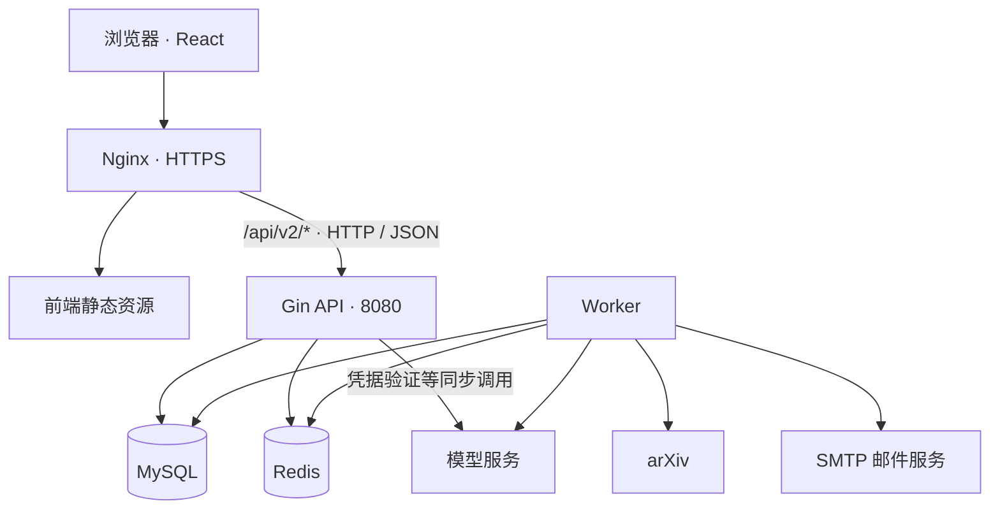

# SignalWatch

SignalWatch 是一个面向 arXiv 的论文订阅与阅读工具。你可以按分类和关键词订阅论文，在网页查看匹配结果，并按自己的时区接收每日邮件。接入个人模型 API Key 后，还可以使用 AI 创建订阅、生成论文报告、追问论文内容和生成邮件导读。

## 架构

项目使用 React / TypeScript / Vite、Go / Gin、MySQL 和 Redis，前端、HTTP API 与后台 Worker 独立运行。



| 组件 | 职责 | 代码位置 |
| --- | --- | --- |
| 前端 | 页面展示、交互、会话管理、任务进度查询 | `web/src/` |
| API | 鉴权、业务校验、数据读写、创建后台任务 | `cmd/api/`、`internal/` |
| Worker | 论文采集、订阅匹配、历史回填、AI 处理、邮件调度与发送 | `cmd/worker/`、`internal/` |
| MySQL | 保存用户、订阅、论文及持久任务状态 | `migrations/` |
| Redis | 限速与运行状态 | `internal/platform/redis/` |
| Nginx | 提供静态页面，将 API 请求转发到后端 | `deploy/nginx/` |

本地由 Vite 提供页面并代理 API 请求，生产环境由 Nginx 提供同域入口。API 不包含前端资源；修改和发布前端无需重启 API 或 Worker。

## 本地启动

以下命令均在项目根目录执行。

### 1. 准备环境

需要 Go 1.26.5（以 [go.mod](go.mod) 为准）、Node.js 22.x、npm、Make 和 Docker Compose v2。先确认当前终端的版本：

```bash
go version
node --version
docker compose version
```

如果使用 nvm，可以通过项目中的 `.nvmrc` 切换 Node：

```bash
nvm install
nvm use
```

新开的前端终端也需要使用 Node 22。Worker 启用论文全文解析时还需 `pdftotext`、`pdfinfo`、`pdfimages` 和 `prlimit`；Debian / Ubuntu 可安装 `poppler-utils` 和 `util-linux`。生产后端镜像已包含这些工具。

### 2. 创建配置

```bash
test -f .env || cp .env.example .env
chmod 600 .env
```

编辑 `.env`，完整选项见 [.env.example](.env.example)。本地配置重点如下：

| 配置 | 说明 |
| --- | --- |
| `MYSQL_PASSWORD`、`MYSQL_ROOT_PASSWORD` | MySQL 应用账号和 root 密码 |
| `MYSQL_DSN` | 数据库连接串；账号、密码和库名需与上述配置一致 |
| `REDIS_PASSWORD` | Redis 密码 |
| `JWT_SECRET` | 至少 32 字符的随机密钥，可用 `openssl rand -hex 32` 生成 |
| `APP_PUBLIC_URL` | 本地可设为 `http://127.0.0.1:5173`，用于邮件中的站内链接 |
| `SMTP_*` | 默认投递到本地 Mailpit；发送真实邮件时填写 SMTP 服务配置 |
| `AI_ENABLED` | 默认 `false`，普通订阅和邮件功能无需模型服务 |

`make api` 和 `make worker` 会读取根目录 `.env`。真实配置与密钥不提交仓库。

### 3. 安装迁移工具并初始化数据库

已有可用的 `goose` 命令时可跳过安装。以下方式将工具保存在项目内：

```bash
make prepare-cache
mkdir -p .tools/bin
GOBIN="$PWD/.tools/bin" \
GOCACHE="$PWD/.cache/go-build" \
GOTMPDIR="$PWD/.cache/tmp" \
TMPDIR="$PWD/.cache/tmp" \
go install -tags=no_sqlite3 github.com/pressly/goose/v3/cmd/goose@v3.24.3

export PATH="$PWD/.tools/bin:$PATH"
make deps-up
make migrate-up
make migrate-status
```

`make deps-up` 启动 MySQL、Redis、Mailpit，并等待服务健康检查通过。迁移需在 API 和 Worker 首次启动前执行。

迁移 `00032` 仅删除已停用的 `ai_daily_usage`、`ai_user_call_leases`，完成后保留 24 张应用表（不含 Goose 版本表）。现有用量统计和调用控制继续使用 `ai_user_daily_usage`、`ai_call_admission`。已有数据库升级前请备份这两张旧表；`Down` 只恢复空表结构，历史数据需从备份恢复。`scripts/repair-00017-partial.sql` 仅用于第 17 次迁移失败的历史状态，不适用于已升级的数据库，也不参与正常启动或升级。

### 4. 启动前端、API 和 Worker

先安装前端依赖并完成一次构建：

```bash
make web-build
```

然后在三个终端中分别进入项目根目录并运行：

```bash
# 终端一：HTTP API
make api
```

```bash
# 终端二：后台任务
make worker
```

```bash
# 终端三：前端页面与热更新
make web-dev
```

| 入口 | 地址 |
| --- | --- |
| 网页 | <http://127.0.0.1:5173> |
| 开发邮件收件箱 | <http://127.0.0.1:8025> |
| API 存活检查 | <http://127.0.0.1:8080/healthz> |
| API 依赖就绪检查 | <http://127.0.0.1:8080/readyz> |

Vite 固定使用 5173 端口，端口占用时会报错。修改 React 或 CSS 后页面自动更新，API 和 Worker 可以持续运行。需要连接其他 API 地址时执行：

```bash
DEV_API_TARGET=http://127.0.0.1:8081 make web-dev
```

各终端使用 `Ctrl+C` 停止对应进程；`make deps-down` 停止依赖容器并保留数据卷。

## 编译

前后端可以分别构建，无需启动 API、Worker 或数据库。

```bash
make backend-build   # 输出 bin/api、bin/worker、bin/ops
make web-build       # 安装前端依赖、检查类型，输出 web/dist
```

`make frontend` 是 `make web-build` 的别名。Go 构建不需要 Node 或前端产物。`web/dist` 用于 Nginx 静态部署；本地开发使用 Vite，不能直接双击 HTML 文件运行页面。

后端二进制读取进程环境变量，不会自动加载 `.env`。直接运行 `bin/api`、`bin/worker` 时，应由进程管理器注入相应配置；本地运行可以继续使用 Makefile，容器运行则由 Compose 注入配置。`bin/ops` 用于重试失败的邮件投递或回填任务。

Makefile 默认将 Go 编译缓存、npm 缓存和临时文件放在项目 `.cache/` 下，权限为仅当前用户可访问。`.cache/`、`.tools/`、`bin/` 和 `web/dist/` 均不提交仓库。

也可以通过 Docker 构建，使用容器内的 Go 或 Node 环境：

```bash
docker build -f deploy/Dockerfile.backend -t signalwatch-backend:local .
docker build --output type=local,dest=web/dist web
```

## Agent 回归测试

后端测试使用隔离 MySQL（本机 `13306` 端口）、随机临时数据库和真实 migrations，不读取应用 `.env`，不调用真实模型。需要 Docker Compose、Go 和 `goose`：

```bash
bash scripts/test-agent.sh
```

脚本运行 Agent 的集成测试和 race 检查，结束后删除本次数据库，保留隔离测试容器。缺少依赖或数据库时直接失败，不以跳过测试代替验收。

前端回归使用 Node 22 和严格 API mock；测试 Vite 不读取 `.env`、不代理真实后端。安装依赖和浏览器后运行：

```bash
make ENV_FILE=/dev/null prepare-cache
export npm_config_cache="$PWD/.cache/npm"
export NODE_COMPILE_CACHE="$PWD/.cache/node-compile"
export TMPDIR="$PWD/.cache/tmp"
export PLAYWRIGHT_BROWSERS_PATH="$PWD/.cache/playwright-browsers"
npm --prefix web ci
(cd web && npx playwright install chromium)
npm --prefix web run test:agent
```

测试缓存、临时文件、浏览器和失败报告统一放在项目 `.cache/`，不提交仓库。仅本轮维护的 Agent 测试及必要工具入库，其他本地历史测试不属于此验收入口。

## 使用

1. 打开网页，注册账号并登录。
2. 在「订阅」中新建订阅，选择 arXiv 分类、填写关键词，并设置每日论文上限。订阅可编辑、暂停或删除。
3. 在「设置」中选择时区和每日邮件时间，例如 `Asia/Shanghai`、`09:00`。
4. 等待 Worker 完成采集和匹配，在论文列表查看结果、打开论文详情。新订阅会后台回填最近七天的本地论文；首次采集需要时间，Worker 必须保持运行。
5. 默认邮件在 Mailpit 中查看；配置真实 SMTP 后，邮件发送到账号邮箱。

### 可选：启用 AI

先生成服务端加密主密钥：

```bash
openssl rand -base64 32
```

将结果填入 API 和 Worker 共用的配置：

```dotenv
AI_ENABLED=true
AI_CREDENTIAL_KEYS=v1:<上一步生成的值>
AI_CREDENTIAL_ACTIVE_KEY_VERSION=v1
AI_ENABLED_PROVIDERS=glm,qwen,deepseek,kimi,openai
```

该主密钥用于加密用户提交的模型 API Key，需备份并保持稳定。修改配置后重启 API 和 Worker。

在网页「API 管理」中新建 API Key，填写名称、供应商、模型和个人 Key，验证并保存。可以保存多个条目，并选择默认条目供摘要和邮件使用。

- **订阅助手**：点击「AI 创建订阅」，描述研究兴趣，检查草案后确认创建。
- **论文助手**：在论文详情打开「AI 论文助手」，选择模型并生成报告。报告包括问题、方法、实验、结果和局限；成功生成后可以继续追问。
- **邮件导读**：在订阅中启用「每日邮件 AI 导读」。

全文获取或解析失败时，论文报告会降级为明确标注的摘要版。AI 任务依赖 Worker，调用次数和间隔可通过 `.env.example` 中的 `AI_*` 配置调整。

## Docker Compose 部署

生产编排见 [deploy/compose.prod.yaml](deploy/compose.prod.yaml)。Nginx 对外开放 80 / 443，HTTP 自动跳转 HTTPS；API、Worker、MySQL 和 Redis 通过容器网络通信。

### 1. 准备生产配置

```bash
test -f deploy/.env.production || cp deploy/.env.example deploy/.env.production
chmod 600 deploy/.env.production
mkdir -p .deploy/web .deploy/certs
```

编辑 `deploy/.env.production`：

- 将 `SERVER_NAME`、`APP_PUBLIC_URL` 改为实际域名和 HTTPS 站点地址。
- 将 `WEB_ROOT`、`TLS_CERT_DIR` 分别设为项目 `.deploy/web`、`.deploy/certs` 的**绝对路径**。准备与域名匹配的 `fullchain.pem` 和 `privkey.pem`，放入证书目录。
- 设置数据库、Redis、JWT 和真实 SMTP 配置。`MYSQL_DSN` 使用容器地址 `mysql:3306`，并与数据库账号配置一致。
- 设置 `BACKEND_VERSION` 作为本次后端镜像标签。API 和 Worker 共用该镜像及配置。
- 将 `MYSQL_VOLUME_NAME`、`REDIS_VOLUME_NAME` 填为要使用的数据卷名。已有环境使用实际已有的卷；全新环境先用 `docker volume create <卷名>` 显式创建这两个卷。

### 2. 启动服务并发布页面

在项目根目录定义命令简写，然后构建后端、启动依赖并执行迁移：

```bash
dc() {
  docker compose --env-file deploy/.env.production -f deploy/compose.prod.yaml "$@"
}

dc config --quiet
dc build api
dc up -d --wait mysql redis
dc run --rm migrate up
dc up -d api worker nginx
```

接着构建并发布前端。将检查地址换成实际站点，`WEB_ROOT` 必须与生产配置中的路径一致：

```bash
make web-build
make web-publish RELEASE=v1 \
  WEB_ROOT="$PWD/.deploy/web" \
  WEB_CHECK_URL=https://signalwatch.example.com
```

Nginx 在首次发布前可以启动，此时页面暂时返回 404。发布检查需要能够通过该 HTTPS 地址访问本机 Nginx；使用私有 CA 时，通过 `WEB_CA_FILE=/绝对路径/ca.pem` 提供证书。完成后访问站点，使用 `dc ps`、`dc logs --tail=100 api worker nginx` 查看运行状态。

### 3. 更新与回滚前端

每次发布使用新的版本号，例如 `v2`；已发布的版本可以直接回滚：

```bash
make web-build
make web-publish RELEASE=v2 \
  WEB_ROOT="$PWD/.deploy/web" \
  WEB_CHECK_URL=https://signalwatch.example.com

make web-rollback RELEASE=v1 \
  WEB_ROOT="$PWD/.deploy/web" \
  WEB_CHECK_URL=https://signalwatch.example.com
```

发布工具校验构建产物后原子切换版本，网页或资源检查失败时恢复原入口。发布和回滚均不重启 Nginx、API 或 Worker，也不执行数据库迁移。旧版本及哈希资源会保留，便于回滚和继续加载旧页面。迁移已有数据或升级不兼容的后端时，应单独安排备份和服务切换。
